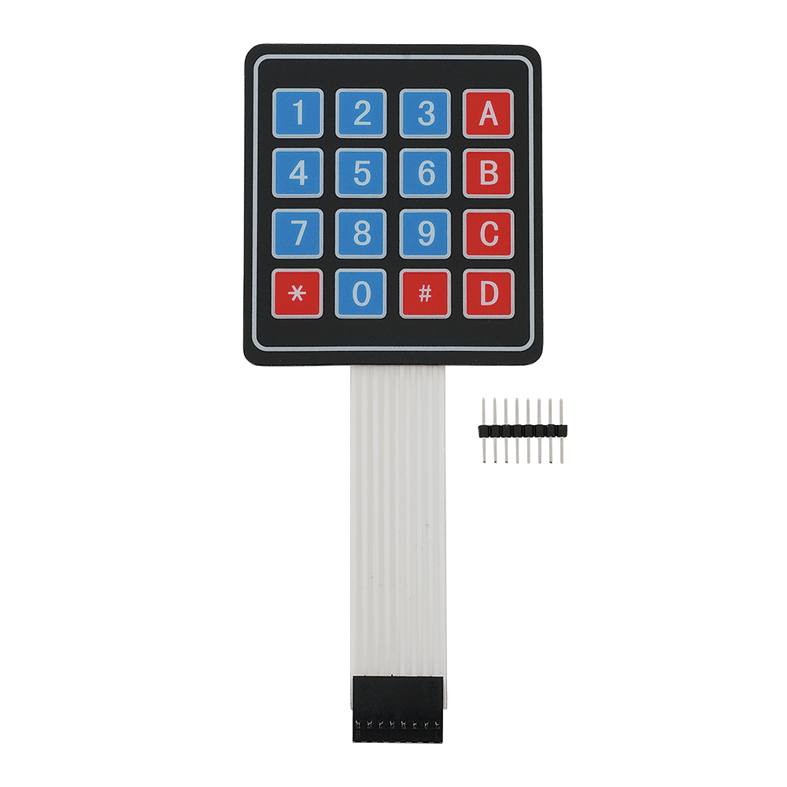
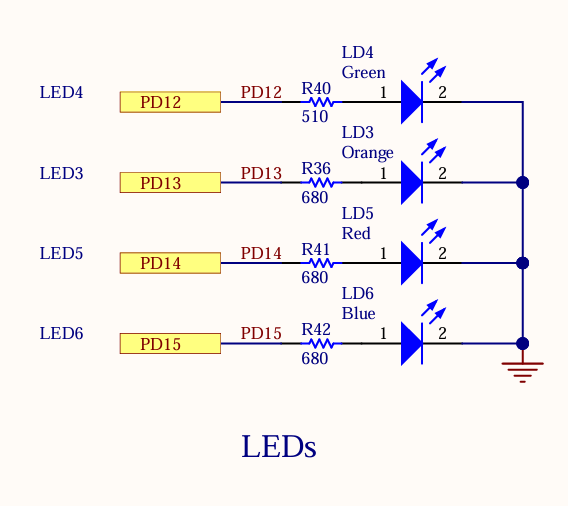
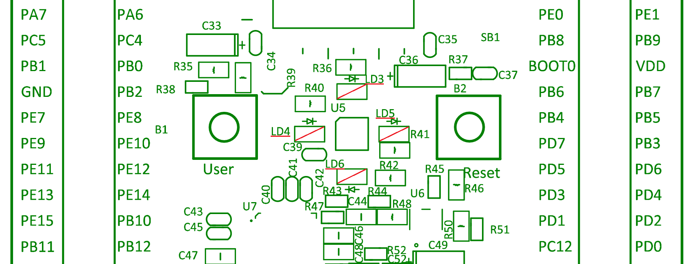

# Simon Says game with SWV ITM Data Console and STM32F4 Discovery LEDs

- ### You will need to connect a 4x4 keypad to 8 free IO pins on your STM32F4Discovery Microcontroller

- ### The keys `2`, `4`, `6`, `8` on the keypad correspond to the LED colors `Orange`, `Green`, `Red`, `Blue` as seen in the Schematic

- ### The game...
	- ### Enter a Difficulty Level 1 or 2 
		- ### 1 = Casual
			- ### Will only light up LEDS in a sequence
			- ### Each correct answer increments score by 1
			- ### Speed and sequence increases for every correct answer
			- ### 3 Lives
		- ### 2 = Pro
			- ### Will light up LEDS and display keypad characters in a sequence
			- ### Each correct answer increments score by 2
			- ### Speed and sequence increases significantly for every correct answer
			- ### 1 Life
	- ### After each sequence, press the keys in the same order as the LEDS, then press `A` key to submit
	- ### Game ends when no lives remain and will display the final score